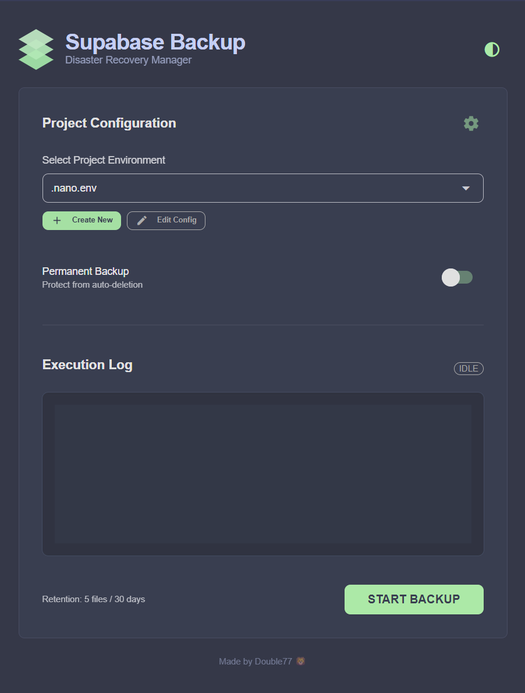

# Supabase Backup - CLI & GUI

This tool provides a secure, automated way to backup your Supabase PostgreSQL databases. It now offers two modes of operation:

1. **Supabase Manager (GUI):** A user-friendly desktop application to manage environments, retention policies, and trigger backups manually.
2. **Backup Engine (CLI):** A headless executable designed for Cron jobs, GitHub Actions, and automated scheduling.

**CLI**


**PORTABLE GUI**



## Overview

## 🚀 Features

- **🆕 Modern GUI Dashboard** : Manage multiple projects, create configs, and view execution logs in a beautiful Catppuccin-themed interface.
- **🆕 Portable Application** : Runs as a standalone Windows executable (`.exe`) without needing Python installed.
- **🆕 Integrated Config Manager** : Create and edit connection details directly inside the app—no more manual file editing.
- **Modular Architecture** : Splits backups into `roles.sql`, `schema.sql`, and `data.sql` for granular restoration.
- **AES-256 Encryption** : Automatically compresses and encrypts backups into protected `.zip` archives.
- **Automated Retention** : Built-in policy engine cleans up old backups based on your settings (e.g., "Keep last 5 files").
- **Permanent Snapshots** : Tag specific backups as "Permanent" to protect them from auto-deletion forever.
- **Headless Mode** : Full CLI argument support for automation.

---

## ⚠️ Critical Prerequisite: PostgreSQL Binaries

Whether you use the GUI or the CLI, **this tool requires PostgreSQL Client Tools to be available.**

The tool uses `pg_dump` and `pg_dumpall` to perform the actual extraction. You have two options:

### Option A: Install Globally (Recommended)

Install PostgreSQL on your machine. The tool will automatically find `pg_dump` in your system PATH.

- **Windows** : Download and install [PostgreSQL Command Line Tools](https://www.enterprisedb.com/downloads/postgres-postgresql-downloads).
- **macOS** : `brew install libpq && brew link --force libpq`
- **Linux** : `sudo apt-get install postgresql-client`

### Option B: Portable Mode

If you cannot install PostgreSQL globally, you can download the binaries zip, extract `pg_dump.exe` (and its DLL dependencies), and place them **inside the same folder** as `SupabaseManager.exe`.

---

## 📥 Installation

### Method 1: Portable App (Recommended for Users)

1. Download the latest **Release ZIP** (`SupabaseBackupTool.zip`) from GitHub.
2. Extract the folder to a location of your choice (e.g., Desktop or Documents).
3. Ensure `pg_dump` is installed (see Prerequisites above).
4. Double-click **`SupabaseManager.exe`** to launch the dashboard.

### Method 2: Running from Source (Developers)

1. **Clone the repository** :
   **Bash**

```
   git clone https://github.com/your-username/supabase-backup-tool.git
   cd supabase-backup-tool
```

1. **Install Dependencies** (Using `uv` is recommended for speed):
   **Bash**

   ```
   pip install uv
   uv pip install -r requirements.txt
   ```

2. **Run the GUI** :
   **Bash**

```
   python gui.py
```

---

## 🖥️ Using the GUI (Supabase Manager)

The GUI acts as a central control center for your backups.

1. **Create a Project** : Click the **+ New** button. Enter your Project Name (e.g., "Production") and Connection URI.
2. **Run a Backup** : Select your project from the dropdown and click **START BACKUP** .
3. **Logs** : Real-time logs will appear in the terminal window at the bottom.
4. **Settings** : Click the ⚙️ (Gear Icon) to configure retention rules (e.g., "Max 5 backups").
5. **Edit Configs** : Select a project and click the **Edit** (Pencil Icon) to update passwords or URIs.

> **Note:** The GUI saves your configurations as `.env` files in the `envs/` folder and your preferences in `settings.json`.

---

## 🤖 Automation & Headless Mode

For scheduled tasks (Cron) or CI/CD pipelines, use the CLI engine.

### If using the Portable App:

Use `backup_engine.exe` located in your extracted folder.

**PowerShell**

```
# Run a backup for the 'production' environment (looks for .production.env)
.\backup_engine.exe --env .production.env --non-interactive

# Create a permanent backup that won't be deleted
.\backup_engine.exe --env .production.env --non-interactive --permanent
```

### If running from Source (Python):

**Bash**

```
python backup.py --env .production.env --non-interactive
```

---

## 🔐 Configuration Details

### Connection String Guide

To ensure stability during large backups, use the **Transaction Pooler** connection string.

1. Go to your Supabase Project Dashboard.
2. Navigate to **Settings** > **Database** .
3. Copy the **URI** (Mode: Transaction) and paste it into the tool.
   - _Format:_ `postgresql://postgres:[PASSWORD]@[HOST]:6543/postgres?pgbouncer=true`

### Environment Files

The tool stores credentials in `envs/`. The file name determines the backup prefix.

- `envs/.production.env` → Backup file: `production_backup_2024...zip`

### Global Settings (`settings.json`)

Managed via the GUI Settings menu, but can be edited manually:

**JSON**

```
{
    "max_backups": 5,       // Keep last 5 files per project
    "retention_days": 30    // Delete files older than 30 days
}
```

---

## ☁️ GitHub Actions (Cloud Automation)

You can run this tool entirely in the cloud using GitHub Actions.

1. **Set Secrets** in your Repo (Settings > Secrets > Actions):
   - `PROD_DB_URI`
   - `ZIP_PASSWORD`
2. **Add the Workflow** : Uncomment the schedule block in `.github/workflows/backup.yml` to enable daily runs.

The workflow will spin up a runner, inject credentials, perform the backup, and commit the encrypted zip back to your repository.

---

## ♻️ Restoration Guide

Since backups are modular, you can restore the entire database or specific parts.

1. **Unzip the Archive** :
   **Bash**

```
   unzip production_backup_2024-01-01.zip -d restore_folder
   # You will be prompted for your ZIP_PASSWORD
```

1. **Run Restoration Commands** :
   Use the [Supabase CLI](https://supabase.com/docs/guides/cli) or `psql` to restore:
   **Bash**

```
   # 1. Restore Roles (Caution: Overwrites permissions)
   supabase db execute --db-url "$SUPABASE_DB_URI" -f restore_folder/roles.sql

   # 2. Restore Schema (Tables, Views, Functions)
   supabase db execute --db-url "$SUPABASE_DB_URI" -f restore_folder/schema.sql

   # 3. Restore Data (Rows)
   supabase db execute --db-url "$SUPABASE_DB_URI" -f restore_folder/data.sql
```

---

## 🔮 Roadmap

- [ ] **Cloud Storage Integration** : Direct upload to AWS S3, Cloudflare R2, or Google Cloud Storage.
- [ ] **Notification Webhooks** : Slack/Discord alerts on backup success/failure.
- [ ] **One-Click Restore** : A `restore.exe` utility to automate the import process.

## 📝 License

This project is licensed under the MIT License.
