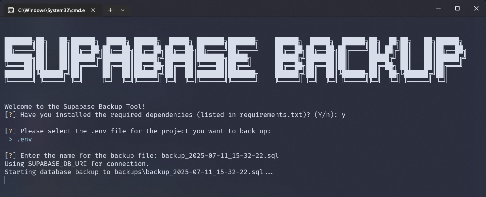

# Supabase Backup CLI

A simple and interactive command-line tool to back up your Supabase PostgreSQL databases.



## Overview

This tool provides a user-friendly interface to create backups of your Supabase projects. It's designed to be easy to use, especially when managing multiple projects, by allowing you to select the appropriate project configuration from `.env` files.

The script uses `pg_dump` to create a `.sql` backup file of your database.

## Features

- **Interactive Interface**: A simple, menu-driven CLI for a smooth user experience.
- **Multi-Project Support**: Easily switch between different Supabase projects by selecting the corresponding `.env` file.
- **Dependency Check**: Automatically checks for and installs required Python packages.
- **Cross-Platform**: Works on both Windows and Unix-like systems (macOS, Linux).

## Prerequisites

Before you begin, ensure you have the following installed:

- **Python 3**: Make sure Python is installed and added to your system's PATH.
- **PostgreSQL Client Tools**: The script relies on `pg_dump` to perform the backup. You must install the PostgreSQL command-line tools.

### Installing PostgreSQL Client Tools

#### Windows
1.  Download the installer from the [PostgreSQL website](https://www.enterprisedb.com/downloads/postgres-postgresql-downloads).
2.  During installation, you only need to select the **"Command Line Tools"** component.
3.  Add the `bin` directory of your PostgreSQL installation (e.g., `C:\Program Files\PostgreSQL\16\bin`) to your system's PATH environment variable.
4.  Verify the installation by opening a new terminal and running `pg_dump --version`.

#### macOS (using Homebrew)
```bash
brew install libpq
brew link --force libpq
```

#### Linux (Debian/Ubuntu)
```bash
sudo apt-get update
sudo apt-get install postgresql-client
```

## Setup and Installation

1.  **Clone the repository:**
    ```bash
    git clone <your-repository-url>
    cd SupabaseBackup
    ```

2.  **Set up environment variables:**
    This tool uses `.env` files to manage database credentials for different projects.

    - Create a separate `.env` file for each Supabase project you want to back up (e.g., `.env.project-one`, `.env.project-two`).
    - Copy the contents of `.env.example` into each of your new `.env` files.
    - Fill in the required credentials for each project in its respective file.

    ```bash
    # Example: Create a .env for "project-alpha"
    cp .env.example .env.project-alpha
    ```
    Then, edit `.env.project-alpha` with the correct credentials.

## How It Works

When you run the script, it will:
1.  Display a welcome message with some ASCII art.
2.  Ask if you have the required Python dependencies installed. If not, it will install them for you.
3.  Scan the directory for all `.env.*` files and present them in an interactive list.
4.  Prompt you to select which project (i.e., which `.env` file) you want to back up.
5.  Load the environment variables from your selected file.
6.  Construct and execute the `pg_dump` command to create the `backup.sql` file in a `backups` directory.

## Usage

To run the backup tool, simply run the following command in your terminal:

```bash
python backup.py
```

The script will then guide you through the process of selecting the correct `.env` file for the project you wish to back up.

## Environment Variables

Your `.env` files can be configured in one of two ways:

#### Option 1: Using `SUPABASE_DB_URI` (Recommended)
This is the simplest method. Provide the full database connection string.

```
SUPABASE_DB_URI=postgresql://postgres:[YOUR-PASSWORD]@[YOUR-HOST]:5432/postgres
```

#### Option 2: Using `SUPABASE_URL` and `DB_PASSWORD`
If you don't have the full URI, you can provide the project URL and the database password separately.

```
SUPABASE_URL=https://your-project-ref.supabase.co
DB_PASSWORD=your-database-password
```

---

## 📝 License

This project is licensed under the MIT License.